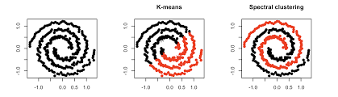

------------------------------------------------------------------------

```{r config, echo=FALSE}
source(system.file("config/hw_config.R", package="R6030")) # knitr settings
options(dplyr.summarise.inform = FALSE)  # ignore dplyr message about grouping
```

```{r, message=FALSE, warning=FALSE, echo=FALSE}
library(igraph)
```

# Table of Contents

### [Introduction](#introduction) {#introduction}

### [Mathematical Methods](#methods)

#### i. [Similarity Graph](#graph)

#### ii. [Laplacian Matrix](#laplacian)

#### iii. [Eigendecomposition](#eigen)

#### iv. [Create Clusters](#clusters)

### [Spectral Coding Clustering Examples](#examples)

#### i. [Using R](#r)

#### ii. [Using Python](#python)

### [Applications](#applications) {#applications}

### [Conclusion](#conclusion) {#conclusion}

### [References](#references) {#references}

# <a name="introduction"></a>

# Introduction

<font size="3">[Clustering]{style="color:royalblue"} is a type of unsupervised learning
algorithm that allows data points to be grouped into "clusters". These
clusters group data points into these clusters so that all data points
in the cluster are similar in some way and dissimilar to the points in
the other clusters. Clustering is useful because it has predictive power
and objects can be grouped which is useful for naming them for
communication. There are several common forms of clustering including;
k-means, mean-shift, density-based spatial clustering of applications
with noise (DBSCAN), expectation maximum (EM), and spectral clustering.
This tutorial will focus on spectral clustering.    <br/><br/>


Spectral clustering is a popular clustering technique due to its ease of
implementation and its ability to outperform other methods (such as the
k-means algorithm). It makes no assumptions about the shape of the
clusters and can use non-graphical data. Spectral clustering uses graph
theory to use the edges to determine communities of nodes. This
technique also differs from k-means and common algorithms because it
uses connectivity instead of compactness like most algorithms.
Compactness uses the distance between points to group them, meaning
points closest together will be grouped. This often means that points
are clustered around a geographic center.  <br/><br/>


```{r, echo=FALSE}

```


When using connectivity, like in spectral clustering, points may be
close together but not in the same cluster. This means that points can result in clusters that
are shaped like spirals or wandering lines. On the other hand, since spectral clustering uses connectivity, it is computationally more
expensive compared to other methods. Meaning this method should be used
for small datasets with high [dimensionality]{style="color:royalblue"}
compared to large datasets with many observations. In addition to being
computationally taxing, larger datasets also tend to decrease the
accuracy of clustering in spectral clustering.   </font> <br/><br/>


# <a name="methods"></a>

# Mathematical Methods

<font size="3"> We should define some basic graph theory terms. A
[graph]{style="color:royalblue"} $G = (V, E)$ consists of a set of
[vertices]{style="color:royalblue"} (nodes), and
[edges]{style="color:royalblue"} which connect the nodes. We can define
our vertex set $V = \{v_1, …, v_n\}$, so each $v_i$ represents a data
point, or node $(\forall i \in 1,\dots , n)$. Let's look at the
following graph as an example:   <br/><br/>

```{r, echo=FALSE, cache=TRUE}
g1 <- graph( edges=c(1,2, 1,3, 1,4, 2,3, 3,4, 7,8, 7,6, 6,8, 6,5), n=8, directed=F ) 
plot(g1, vertex.size=38, vertex.color = "deepskyblue", vertex.label.color="black", edge.width = 2, edge.color="black", frame.color="black")

```

Our graph has 8 vertices and 9 edges. In this case, the edges are
undirected and have no weights associated with them. Two nodes are
[adjacent]{style="color:royalblue"} if they are connected by an edge.
The [neighborhood]{style="color:royalblue"} of a vertex is the set of
vertices that are adjacent to it. So, the neighborhood of vertex 1 is
$\{2,3,4\}$, the neighborhood of vertex 7 is $\{6,8\}$. The
[degree]{style="color:royalblue"} of a vertex is how many edges are
[incident]{style="color:royalblue"} (connected) to it. Since our graph
is undirected, we can assume the in-degree equals the out-degree. In
this example, the degree of each vertex in-order is:
$\{3,2,3,2,1,3,2,2\}$. We can construct a degree matrix where we have a
row and column for each vertex, and the degree of each node is on the
diagonal while the off-diagonals are zero. Another way to represent this
graph is through an [adjacency matrix]{style="color:royalblue"}.
Adjacency matrices have rows and columns for each node and indicate if
an edge is [incident]{style="color:royalblue"} between two nodes (1 if
yes, 0 if no). If our edges had weights, we would replace the 1 with the
corresponding weight. The degree and adjacency matrix for this graph are
as shown below, respectively:   <br/><br/>

$$
\begin{equation} 
  \begin{bmatrix} 
    3 & 0 & 0 & 0 & 0 & 0 & 0 & 0  \\ 
    0 & 2 & 0 & 0 & 0 & 0 & 0 & 0  \\ 
    0 & 0 & 3 & 0 & 0 & 0 & 0 & 0  \\ 
    0 & 0 & 0 & 2 & 0 & 0 & 0 & 0  \\ 
    0 & 0 & 0 & 0 & 1 & 0 & 0 & 0  \\ 
    0 & 0 & 0 & 0 & 0 & 3 & 0 & 0  \\ 
    0 & 0 & 0 & 0 & 0 & 0 & 2 & 0  \\ 
    0 & 0 & 0 & 0 & 0 & 0 & 0 & 2   
  \end{bmatrix} 
\hspace{1cm}
  \begin{bmatrix} 
    0 & 1 & 1 & 1 & 0 & 0 & 0 & 0  \\ 
    1 & 0 & 1 & 0 & 0 & 0 & 0 & 0  \\ 
    1 & 1 & 0 & 1 & 0 & 0 & 0 & 0  \\ 
    1 & 0 & 1 & 0 & 0 & 0 & 0 & 0  \\ 
    0 & 0 & 0 & 0 & 0 & 1 & 0 & 0  \\ 
    0 & 0 & 0 & 0 & 1 & 0 & 1 & 1  \\ 
    0 & 0 & 0 & 0 & 0 & 1 & 0 & 1  \\ 
    0 & 0 & 0 & 0 & 0 & 1 & 1 & 0   
  \end{bmatrix}
\end{equation}
$$

There appear to be two distinct sub-sections of the graph, these are
called connected components. A [connected
component]{style="color:royalblue"} is a subgraph in which each pair of
nodes is connected to another via a [path]{style="color:royalblue"} (a
finite sequence of edges which joins vertices). Since no node has an
edge to itself, this graph is [simply
connected]{style="color:royalblue"}. Our graph contains two connected
components: $\{1,2,3,4\}$ and $\{5,6,7,8\}$. When it comes to
clustering, an immediate idea would be to define each connected
component as its own cluster. However, what if our graph only consists
of one connected component, i.e., the entire graph is connected? Or what
if within each connected component, we want to define smaller, more
defined clusters? Connected components are integral in spectral
clustering, and we will expand on this further down.   <br/><br/>


Now we can begin our spectral clustering process. The algorithm can be
outlined in four key steps:   <br/><br/>


       I. Generate a similarity graph\
       II. Compute the Laplacian Matrix\
       III. Eigendecomposition\
       IV. Create clusters\ </font>


### <a name="graph"></a>

### I Similarity Graph

<font size="3">  We start by computing a [similarity graph]{style="color:royalblue"}
$G = G(V, E)$. Let's assume our graph is undirected. We can represent
this graph through an adjacency matrix composed of the similarities
between nodes.   <br/><br/>

Computing the distance between two points is more intuitive for some
problems than others. If we have a simple 2-D dataset with distance
values on each axis, we can use the Euclidian distance formula
$\sqrt{x^{2}+y^{2}}$. However, for datasets with higher dimensionality,
the distance between two points isn't as intuitive. Fortunately, the
Euclidian distance formula has a dimension-generic version:
$dist(x,y)=\sqrt{\sum_{i} (y_i-x_i)}$. We can apply this to numeric data
of any dimension to compute the distance between two points.   <br/><br/>

We use the Euclidian distance formula when constructing our [similarity
matrix]{style="color:royalblue"} S. The formula for an entry in S is as
follows:   <br/><br/>

```{=tex}
\begin{equation}
s(x_i,x_j) = \text{exp} \left (-\frac{||x_i-x_j||^2}{2\sigma^2} \right )
\end{equation}
```
Where $x_i$ and $x_j$ are the two data points, $||x_i-x_j||$ is their
Euclidian distance, and sigma $\sigma$ is a scaling constant to control
for the width of the neighborhoods. For our example, since our edges
aren't weighted, we will assume the similarity matrix is the same as the
adjacency matrix.  </font>  <br/><br/>

### <a name="laplacian"></a>

### II Laplacian Matrix

<font size="3">  The next step is to compute the [Laplacian
Matrix]{style="color:royalblue"}, which we'll then perform
eigendecomposition on. The motivation behind this is that the Laplacian
reduces the dimensionality of our data, such that observations in the
same cluster will be close to each other, while observations in
different clusters will not.   <br/><br/>

The Laplacian matrix $L$ is computed by taking the difference of the
degree matrix $D$ and the similarity matrix $S$. To calculate the degree
$d(x)$ of our observations, we use the following formula:   <br/><br/>

```{=tex}
\begin{equation}
d_i = \sum_{j|(i,j) \in E} w_{ij}
\end{equation}
```
This formula differs from the one introduced above, because we are now
dealing with weighted edges. Rather than simply computing the number of
edges a node has, we now take the sum of the weights on all the edges.
Our matrix $D$ is the values of $d(x)$ along the diagonal, with all
non-diagonal values set to 0.Once $D$ is computed, we use it along with $S$: $L = D – S$.   <br/><br/>

The Laplacian matrix for our working example is given below:   </font>  <br/><br/>

$$\begin{equation}
  \begin{bmatrix}
    3 & -1 & -1 & -1 & 0 & 0 & 0 & 0  \\
    -1 & 2 & -1 & 0 & 0 & 0 & 0 & 0  \\
    -1 & -1 & 3 & -1 & 0 & 0 & 0 & 0  \\
    -1 & 0 & -1 & 2 & 0 & 0 & 0 & 0  \\
    0 & 0 & 0 & 0 & 1 & -1 & 0 & 0  \\
    0 & 0 & 0 & 0 & -1 & 3 & -1 & -1  \\
    0 & 0 & 0 & 0 & 0 & -1 & 2 & -1  \\
    0 & 0 & 0 & 0 & 0 & -1 & -1 & 2  
  \end{bmatrix}
\end{equation}$$

### <a name="eigen"></a>

### III Eigendecomposition

<font size="3">  Now we can obtain the [eigenvectors]{style="color:royalblue"} and
[eigenvalues]{style="color:royalblue"} of the Laplacian matrix. Given
our matrix $L$, we can define an eigenvector $x$ and its corresponding
eigenvalue $\lambda$ as any pair which satisfies the following:  <br/><br/>


```{=tex}
\begin{equation}
Lx = \lambda x
\end{equation}
```

This is known as [eigendecomposition]{style="color:royalblue"}. For
large matrices, these values are not computable by hand. That's why we
use computers! Further below we'll see an example of eigendecomposition
performed on a large matrix.  <br/><br/>


Once we have these, we can find the vectors associated with the $k$
largest eigenvalues and form a new matrix from these. The number of
eigenpairs that we want to keep is based on the number of clusters we
want. If we don't know how many clusters we want, we sort our
eigenvalues in non-decreasing order:
$\lambda_1 \leq \lambda_2 \leq \dots \lambda_n$. We then look for the
initial point where the eigenvalues increase sharply, and only take only
eigenvalues before that. The number of eigenvalues that are equal to
zero is equal to the number of connected components in our graph.
Therefore, the number of total eigenvectors we keep is equal to the
number of clusters we want.  <br/><br/>


Let's go back to our working example. Keep in mind our graph consists of
8 vertices, therefore we will have 8 eigenvalues and 8 eigenvectors. The
results of our eigendecomposition are shown below:  <br/><br/>


$$\begin{equation} 
  \begin{bmatrix} 
    1 & 0 & 0 & 0 & 0 & -1 & -2 & 0  \\ 
    1 & 0 & 0 & -1 & 0 & 0 & 1 & 0  \\ 
    1 & 0 & 0 & 0 & 0 & 1 & 0 & 0  \\ 
    1 & 0 & 0 & 1 & 0 & 0 & 1 & 0  \\ 
    0 & 1 & -2 & 0 & 0 & 0 & 0 & 1  \\ 
    0 & 1 & 0 & 0 & 0 & 0 & 0 & -3  \\ 
    0 & 1 & 1 & 0 & -1 & 0 & 0 & 1  \\ 
    0 & 1 & 1 & 0 & 1 & 0 & 0 & 1   
  \end{bmatrix} 
\end{equation} $$


Each eigenvector is a column, corresponding to an eigenvalue. Our
eigenvalues for our working example are: $\{0, 0, 1, 2, 3, 4, 4, 4\}$.
Since our graph has two connected components, we have two eigenvalues
equal to zero, the rest non-zero. If we wanted our graph to have k
clusters $(k>2)$, we would simply normalize our Laplacian matrix by
$L_{norm} = D^{½}LD^{½}$ and redo the above steps.    </font>  <br/><br/>


### <a name="clusters"></a>

### IV Create clusters

<font size="3">  Now the fun part! We have a set of eigenvectors, sorted by their
corresponding eigenvalue in non-decreasing order. Suppose we've decided
we want $k=4$ clusters. We would then select the first four eigenvectors
and put them through a clustering algorithm such as
[K-Means]{style="color:royalblue"}, which would output our cluster
assignments! Below is the output when running K-means for the first four
eigenvectors of our example: $\{0, 1, 1, 0, 3, 2, 2, 2\}$  <br/><br/>


And as a visual:  <br/><br/>


```{r, echo=FALSE, cache=TRUE}
g2 <- graph( edges=c(1,2, 1,3, 1,4, 2,3, 3,4, 7,8, 7,6, 6,8, 6,5), n=8, directed=F ) 
V(g2)[1]$color <- 'deepskyblue'
V(g2)[2]$color <- 'darkolivegreen2'
V(g2)[3]$color <- 'darkolivegreen2'
V(g2)[4]$color <- 'deepskyblue'
V(g2)[5]$color <- 'hotpink1'
V(g2)[6]$color <- 'darkorchid1'
V(g2)[7]$color <- 'darkorchid1'
V(g2)[8]$color <- 'darkorchid1'
plot(g2, vertex.size=38, vertex.label.color="black", edge.width = 2, edge.color="black", frame.color="black")
```


Note the graph has been subdivided into 4 sections, with nodes 1 and 3
arbitrarily assigned to one of their connected sections. </font>  <br/><br/>


# <a name="examples"></a>

# Spectral Clustering Coding Examples

# <a name="r"></a>

## Using R


<font size="3">  By this point we have laid the foundation for spectral clustering, but
our working example wasn't really that complicated. Let's look at how to
implement spectral clustering and compare the results to a k-means
approach. </font>  <br/><br/>


```{r message=FALSE, warning=FALSE, cache=TRUE}
## Packages
library(tidyverse)
library(gridExtra)
library(ggplot2)
```


<font size="3">  We first need to generate some data for clustering. We will generate
three circular, uniform distributions and plot them: </font>  <br/><br/>


```{r, cache=TRUE}
# Generate circular uniform distributions of data
set.seed(1748)

## Set min and max parameters for each distribution
min_vals <- c(0.05, 0.5, 1.5)
max_vals <- c(0.15, 0.8, 2.0)
x <- c() 
y <- c() 

## Generate distributions using parameters
for(i in 1:3){
  r <- sqrt(runif(250, min = min_vals[i], max = max_vals[i]))
  p <- runif(250)
  theta <- p * 2 * pi
  x_temp <- r * cos(theta)
  y_temp <- r * sin(theta)
  x <- c(x, x_temp)
  y <- c(y, y_temp)
}

## Create data frame
data <- as.data.frame(cbind(x, y))

## Plot coordinates
ggplot(data=data, aes(x=x, y=y)) + geom_point()

```


<font size="3">  Our goal is to cluster the data. By sight, there are clearly three rings
representing the three distributions of data. We will cluster the data
using k-means first:   </font> <br/><br/>


```{r, cache=TRUE}
# Kmeans Application
set.seed(1748)

## Run Kmeans algorithm with 3 clusters
km <- kmeans(data, 3) 


## Retrieve and store cluster assignments
kmeans_clusters <- km$cluster
kmeans_results <- cbind(data, cluster = as.factor(kmeans_clusters))
head(kmeans_results)
```


<font size="3">  The output above represents the cluster each point is assigned to using
k-means. We will now calculate the cluster assignments using spectral
clustering:  </font> <br/><br/>


```{r, cache=TRUE}
# Spectral Clustering

## Create Similarity matrix of Euclidean distance between points
S <- as.matrix(dist(data))


## Create Degree matrix
D <- matrix(0, nrow=nrow(data), ncol = nrow(data)) # empty nxn matrix

for (i in 1:nrow(data)) {
  
      # Find top 10 nearest neighbors using Euclidean distance
      index <- order(S[i,])[2:11]
      
      # Assign value to neighbors
      D[i,][index] <- 1 
}

# find mutual neighbors
D = D + t(D) 
D[ D == 2 ] = 1

# find degrees of vertices
degrees = colSums(D) 
n = nrow(D)


## Compute Laplacian matrix
# Since k > 2 clusters (3), we normalize the Laplacian matrix:
laplacian = ( diag(n) - diag(degrees^(-1/2)) %*% D %*% diag(degrees^(-1/2)) )


## Compute eigenvectors
eigenvectors = eigen(laplacian, symmetric = TRUE)
n = nrow(laplacian)
eigenvectors = eigenvectors$vectors[,(n - 2):(n - 1)]


set.seed(1748)
## Run Kmeans on eigenvectors
sc = kmeans(eigenvectors, 3)


## Pull clustering results
sc_results = cbind(data, cluster = as.factor(sc$cluster))
head(sc_results)
```


<font size="3">  The output above represents the cluster each point is assigned to using
spectral clustering. Let's now graph the data and use colors to
represent the cluster assignment of both k-means and spectral
clustering: </font> <br/><br/>


```{r, fig.height=8, fig.width=16}
# Kmeans plot
kmeans_plot = ggplot(data = kmeans_results, aes(x=x, y=y, color = cluster)) + 
  geom_point() + 
  scale_color_manual(values = c('1' = "violetred2",
                                '2' ="darkorchid2",
                                '3' ="darkolivegreen2")) +
  ggtitle("K-Means Clustering") +
  theme(panel.grid.major = element_blank(), panel.grid.minor = element_blank(),
        panel.background = element_blank(), axis.line = element_line(colour = "black"),
        plot.title = element_text(hjust = 0.5), legend.position="bottom")

# Spectral Clustering plot
sc_plot = ggplot(data = sc_results, aes(x=x, y=y, color = cluster)) + 
  geom_point() + 
  scale_color_manual(values = c('1' = "violetred2",
                                '2' ="darkorchid2",
                                '3' ="darkolivegreen2")) +
  ggtitle("Spectral Clustering") +
  theme(panel.grid.major = element_blank(), panel.grid.minor = element_blank(),
        panel.background = element_blank(), axis.line = element_line(colour = "black"),
        plot.title = element_text(hjust = 0.5), legend.position="bottom")

# Arrange plots
grid.arrange(kmeans_plot, sc_plot, nrow=1)
```


<font size="3"> We have now learned how spectral clustering works and how to implement
it with R. As an added bonus, we were able to visualize the advantage of
using spectral clustering when compared to k-means clustering. </font> <br/><br/>


# <a name="python"></a>

## Using Python


<font size="3"> We've also included an example of spectral clustering in Python for image segmentation: </font> <br/><br/>

```{r, echo=FALSE}
htmltools::includeHTML("SpectralClusteringPython.html")
```

# <a name="conclusion"></a>

# Conclusion


<font size="3"> We now have a basic understanding of the underlying graph theory and
linear algebra necessary for spectral clustering. To summarize, we
started our spectral clustering process by representing our data as a
graph, where the vertices are data points the edges represent the
similarities between the points. Next, we generated the Laplacian matrix
using the similarities and degrees of each node, which we performed
eigendecomposition on. The eigenvalues help determine the suggested
number of clusters and the eigenvectors dictate the actual labels of the
data points in each cluster.  <br/><br/>


Spectral clustering has become increasingly popular for several reasons.
It makes no assumptions about the shape of the clusters, and its
implementation is much easier than other similar methods. Compared to
these methods, spectral clustering outperforms them in terms of
accuracy. By using dimension reduction, it can correctly cluster
observations that truly belong to the same cluster but may be farther in
distance than observations in other clusters. In terms of speed,
spectral clustering works best when datasets are sparser. Additionally,
this technique offers a more flexible approach for finding clusters,
useful for datasets which don't meet the requirements for other
algorithms.  <br/><br/>


However, this does not mean that spectral clustering is without its
limitations. It is more computationally complex compared to similar
methods, the reason being how it uses connectivity. When there is more
data, more eigendecomposition needs to be performed, sharply increasing
the time complexity. In terms of scalability, the accuracy of spectral
clustering decreases on larger datasets. Furthermore, in the final step
of the algorithm, K-means is used to determine the clusters. As a
result, based on the choice of the initial centroids, the final clusters
generated are not always the same. Replicating our results is not
something we can accomplish using this method.  </font>  <br/><br/>

# <a name="applications"></a>

# Applications

<font size="3"> There are many applications of spectral clustering. EDA (exploratory
data analysis), machine learning, and computer vision problems all
benefit from the use of spectral clustering. Due to its self-tuning
power, spectral clustering is useful in 3D image analysis. This is
especially useful in the medical research community as well as the
practice of medicine. One application of 3D image analysis includes
identifying lower extremity skin wounds in the elderly using optical
scans and then feeding those images to the algorithm for processing.
Another medical application is in researching therapeutic responses to
pancreatic cancers. Spectral clustering can be used to generate gene
clusters from cell-line data and CRISPR-Cas9 data which has potential to
identify better tissue targets for cancer therapies.   <br/><br/>


Outside of the medical field, image segmentation through spectral clustering can be used to footage. 
For example, an individual frame in a movie can be analyzed using spectral 
clustering which could then result in summarization. This could be useful for 
giving a visual summary of larger pieces of film.   </font>  <br/><br/>


# <a name="references"></a>

# References

<https://bmcmedgenomics.biomedcentral.com/articles/10.1186/s12920-020-0681-6> 

<https://datacarpentry.org/image-processing/aio/index.html> 

<http://ijcsit.com/docs/Volume%206/vol6issue01/ijcsit2015060141.pdf> 

<https://pubmed.ncbi.nlm.nih.gov/27520612/> 

<https://rpubs.com/nurakawa/spectral-clustering>

<https://scholarship.claremont.edu/cgi/viewcontent.cgi?article=2735&context=cmc_theses> 

<https://scikit-learn.org/stable/auto_examples/cluster/plot_segmentation_toy.html> 

<https://stackoverflow.com/questions/47689968/python-code-chunk-graphs-not-showing-up-in-r-markdown> 

<https://stackoverflow.com/questions/6799105/spectral-clustering-image-segmentation-and-eigenvectors> 

<https://towardsdatascience.com/spectral-clustering-aba2640c0d5b> 

<https://towardsdatascience.com/spectral-clustering-82d3cff3d3b7> 

<https://www.analyticsvidhya.com/blog/2021/05/what-why-and-how-of-spectral-clustering/> 

<https://www.geeksforgeeks.org/working-with-images-in-python-using-matplotlib/> 

<https://www.kaggle.com/datasets/joanpau/bike-rentals-study-uci> 
